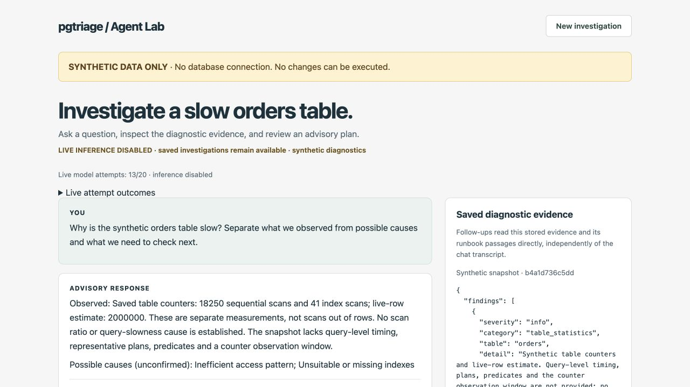

# pgtriage Agent Lab

A TypeScript reference runtime for **evidence-based PostgreSQL investigations**.
Models propose diagnostic steps and advice; application code controls tool access,
workflow state, retries, and output validation.

The problem is not just getting a model to answer a database question. It is knowing
which evidence the answer used, whether the tool call was authorized, and what to
do when a request fails after work may already have started.

Agent Lab is a companion to [pgtriage](https://github.com/pgtriage/pgtriage), the
Python MCP server that collects database diagnostics. The two projects are
independently installable: pgtriage owns the audit, while Agent Lab explores the
orchestration and policy around it.

**Default demos use synthetic data and deterministic test models. No remediation
is executed.** The optional CLI integration can run real database diagnostics;
the Cloudflare chat demo cannot connect to a database.

[Illustrated walkthrough](docs/review/WALKTHROUGH.md) ·
[Architecture](docs/architecture.md) ·
[Development prompt history](PROMPTS.md) ·
[Recorded live results](cloudflare/LIVE-RESULTS.md)

## Two ways to explore it

| | Local MCP runtime | Cloudflare chat demo |
| --- | --- | --- |
| Interface | CLI with structured JSON or concise output | Browser chat with saved investigations |
| Diagnostics | Fixture MCP server by default; optional real pgtriage integration | Fixed synthetic incident, no database connection or live MCP transport |
| Model | Deterministic test model; optional Anthropic adapter in real-tool mode | Deterministic locally; Workers AI in the recorded hosted tests |
| State | Memory by default; opt-in SQLite with idempotency and leases | SQLite-backed Durable Objects for investigation state and a shared inference quota |
| What to inspect | Tool authorization, schema scope, retry classification and workflow transitions | Evidence-based follow-ups, refresh without inference, identity/ownership and bounded model use |

Both use the shared TypeScript contracts, policy and orchestration components.
Their adapters and failure behavior differ; a result from one mode is not evidence
that the other mode was tested.

## See an investigation

The [one-minute walkthrough](docs/review/WALKTHROUGH.md) shows an actual saved
Workers AI response over a **synthetic** PostgreSQL snapshot. No cloud account or
staging access is needed.



The application renders observed measurements separately from model-generated
hypotheses and diagnostic next checks. The snapshot does not establish why a query
is slow. Exact observations and mandatory safety notices are application-owned,
not evidence of model reasoning. Refresh restores the saved result rather than
asking the model to recreate it.

Private staging is not a public interactive demo; live inference is disabled.
The local demo below is available without credentials.

## Quick start

Requires Node.js 22 or newer and npm.

```bash
git clone https://github.com/manas-maheshwari/pgtriage-agent-lab.git
cd pgtriage-agent-lab
npm ci
```

### Local MCP runtime

```bash
npm run demo:mcp:concise
```

This starts a fixture MCP server over stdio, runs the bounded audit workflow and
prints an advisory result. It needs no model API key or PostgreSQL instance.
Use `npm run demo:fixture:concise` for the equivalent in-process tool demo.

The CLI uses **in-memory storage by default**. To retain workflow state across runs:

```bash
SQLITE_WORKFLOWS=1 npm run demo:mcp:concise
```

The SQLite file lives under `runs/`. The demo uses a fixed idempotency key per mode,
so repeating a completed SQLite-backed demo returns its existing workflow rather
than running another audit. Persistence and lease primitives are not a guarantee
of exactly-once external execution or an unattended recovery service.

For explicitly approved database diagnostics, see the
[real pgtriage integration guide](docs/local-runtime.md). That mode can contact a
real database even when no model API key is set; do not use it as a synthetic demo.

### Run locally (no live inference)

```bash
npm run dev:cloudflare
```

Open http://127.0.0.1:8787. Ask "Why is the orders table slow?", refresh, then ask
"What should I check next?". The page says **LOCAL TEST MODEL**: its fixed responses
demonstrate persistence, evidence reuse and rendering, not live LLM reasoning.

Local state persists under `.wrangler/state/`; use the same browser and hostname.
"New investigation" creates another session without deleting earlier records.
Enter synthetic questions only. This local configuration has no Workers AI binding
and is not a deployment configuration.

## Engineering decisions worth inspecting

- **Authorization is code, not a prompt.** The planner's proposal must match the
  allowed tool and caller-supplied schema scope. MCP annotations inform checks;
  they never grant permission by themselves.
- **A lost caller does not mean the audit never ran.** The MCP adapter distinguishes
  proven pre-dispatch failures from ambiguous failures after dispatch. It does not
  automatically repeat a non-idempotent audit that may still be running.
- **Saved evidence is not chat memory.** Cloudflare follow-ups use persisted
  measurements and retrieved runbook passages, not the previous transcript, and
  do not rerun diagnostics.
- **Valid JSON is not sufficient.** Typed schemas and advisory policy are followed
  by evidence and citation checks. The chat adapter adds targeted guards for
  observed failure cases; these do not establish general factual correctness.
- **Usage controls precede inference.** Hosted attempts are reserved in a shared
  persisted quota before dispatch, including failures. A deadline does not promise
  cancellation of a provider request already accepted.

See [architecture](docs/architecture.md) for the core boundaries and
[Cloudflare implementation notes](cloudflare/README.md) for the hosted adapter,
model/application responsibility split and assignment mapping.

## Validation and known limits

```bash
npm run check:all
npx playwright install chromium
npm run test:all
npm run eval
```

The September 26 recorded suite passed **78 tests** (35 core, 40 Cloudflare,
3 browser) plus both type checks and **26 deterministic evaluation cases**.
The [evaluation report](artifacts/eval-report.md) measures fixture-based contracts,
not real-model accuracy. CI runs the automated checks without cloud credentials.

Tests include execution-time policy checks, storage eviction/recreation,
ownership isolation, quota/shutdown enforcement, invalid output and safe browser
rendering. A counterfactual test changes stored scan counts and removes the chat
transcript, then verifies the follow-up uses the changed evidence.

The [live record](cloudflare/LIVE-RESULTS.md) separately documents real provider
failures and advice-quality corrections. The final v4 review tested one fresh
investigation; earlier versions exercised follow-up and recovery. Those paths
were not all repeated against v4. Its hypotheses remain broad and unconfirmed.

This is a reference implementation, not an autonomous DBA or production-ready
database service. There is no automatic DDL/DML remediation, multi-agent system,
or general-purpose SQL execution tool. Real audits can still execute diagnostic
queries and consume database resources. Retrieval uses a small local runbook
corpus; citation membership is not proof that a claim is supported. Interrupted
hosted turns fail without automatic replay, and timeouts cannot guarantee provider
cancellation. See [milestones](docs/milestones.md) for remaining acceptance gaps and
the [postmortem](docs/postmortem.md) for design changes after testing.

## Repository map

```text
src/                  Core contracts, orchestrator, policy, adapters and CLI
cloudflare/           Worker, investigation/quota Durable Objects, auth and model adapter
public/               Chat UI assets
corpus/               Local diagnostic runbooks
test/                 Core unit and integration tests
cloudflare/test/      Workers and Durable Object tests
browser-test/         Browser tests
artifacts/            Generated deterministic evaluation reports
docs/                 Architecture, local integration and review walkthrough
PROMPTS.md            Development prompts, labeled redactions and assistant summaries
.github/workflows/    CI
```

Generated `runs/`, `.wrangler/` state and dependencies stay out of Git.
Runtime prompts are in the model adapters; [PROMPTS.md](PROMPTS.md) is the
AI-assisted development record, not the application's system prompt.
[Privacy review](docs/review/PRIVACY-CHECK.md) and
[private staging procedure](cloudflare/STAGING.md) document publication and
operator checks.
