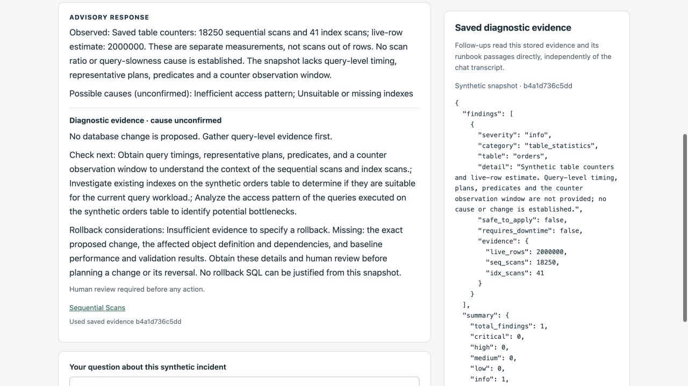

# One-minute walkthrough: a saved real-model investigation

**SYNTHETIC DATA ONLY · real Workers AI response · inference now disabled.**
No staging login is needed: the screenshots and full text are part of this repository.
These are captures of the saved v4 investigation, not a mock or a new model run.

### 1. Ask about the fictional incident

The submitted question was:

> Why is the synthetic orders table slow? Separate what we observed from possible causes and what we need to check next.

The Worker accepted the authenticated chat request. The investigation Durable Object
coordinated a model planning call, the fixed synthetic diagnostic and a synthesis
call, then saved the validated answer and evidence. Both live calls succeeded.
The initial question ran earlier; this capture only reads its saved result.

### 2. Read observations, hypotheses and next checks separately

The application supplies the exact observed counters: 18,250 sequential scans,
41 index scans and an estimated 2,000,000 live rows. It explicitly says these do
not establish a scan ratio or a cause of slowness. The model suggests **unconfirmed**
access-pattern/index hypotheses and asks for timings, query plans, predicates,
existing indexes and an observation window.

No change is proposed. The application-owned rollback notice explains which facts
are missing; it contains no placeholder SQL. The right panel shows the persisted
synthetic evidence. Both panels identify snapshot `b4a1d736c5dd`.

[Read the full unedited response as text](../../cloudflare/EVIDENCE-REVIEW-2026-09-26.md).
The hypotheses are broad, not proven causes. No post-change advice appears.

### 3. Refresh: restore, do not regenerate

During this capture, reloading restored the **exact same answer and evidence**.
The quota stayed **13/20**, inference stayed disabled and the Investigate button
was disabled. No model calls were made to prepare this walkthrough.

| Observed during capture | Result |
| --- | --- |
| Answer text before vs. after reload | Exact match |
| Saved evidence before vs. after reload | Exact match |
| Shared quota after reload | 13/20, disabled |
| New question submission | Disabled |

A screenshot alone cannot prove persistence; these are the accompanying observed
checks. The automated [Workers tests](../../cloudflare/test/app.test.ts) also cover
storage eviction and a follow-up using changed saved evidence with no prior chat.
No new follow-up was submitted during this capture. Earlier live follow-up and
failure/recovery results are separately recorded in the [live test log](../../cloudflare/LIVE-RESULTS.md).

## Reproduce the flow yourself

Use the [README's local instructions](../../README.md#run-locally-no-live-inference).
The local model is deliberately labeled deterministic; it demonstrates the same
storage and UI flow without credentials or paid inference. Its output must not be
presented as a new live-model result.

Capture provenance: 2026-09-26, private staging's saved `synthetic-advisor-v4`
investigation, browser content only. No dashboard, address bar, login, identity,
cookie or token is included. Images were visually reviewed; no image redactions
or edits were needed. This is an illustrated walkthrough, not a video recording.
